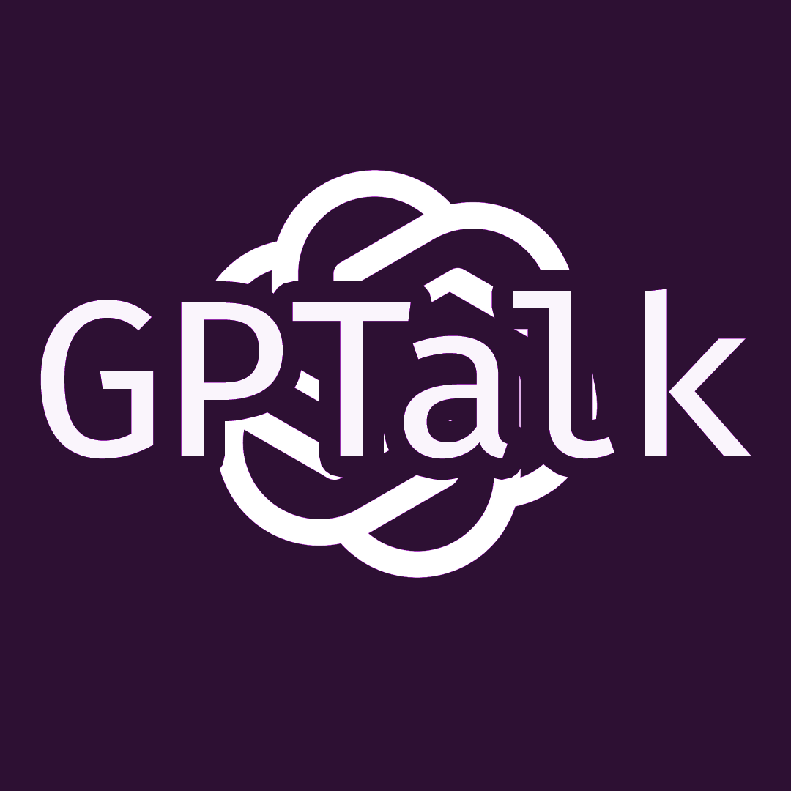
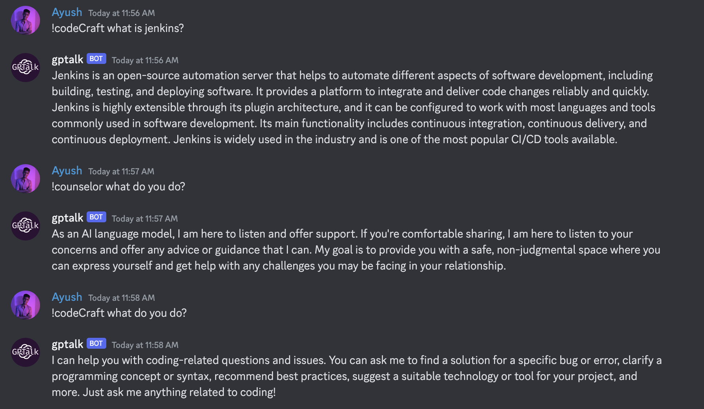
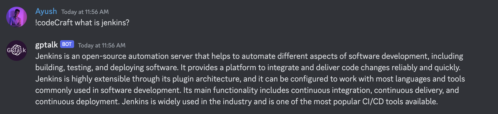

<a name="readme-top"></a>

<!-- PROJECT LOGO -->
<br />
<div align="center">
  <a href="https://github.com/ayushgml/gptalk">
    
  </a>

  <h3 align="center">GPTalk</h3>

  <p align="center">
    A discord bot that uses GPT-3.5-Turbo to generate text
    <br />
    <a href="https://github.com/ayushgml/gptalk"><strong>Explore the docs »</strong></a>
    <br />
    <br />
    <a href="https://github.com/ayushgml/gptalk">View Demo</a>
    ·
    <a href="https://github.com/ayushgml/gptalk/issues">Report Bug</a>
    ·
    <a href="https://github.com/ayushgml/gptalk/issues">Request Feature</a>
  </p>
</div>

<!-- ABOUT THE PROJECT -->
## About The Project
<div align="center">
    
</div>
This is a discord bot made using OpenAi's GPT-3.5-Turbo. It can generate text based on a prompt. Currently, it has 10 modes of operation. It can generate text in the following modes:
<ol>
    <li><b>codeCraft</b> - a code helper and bug solution advisor</li>
    <li><b>counselor</b> - Offers advice and guidance on a range of topics, such as relationships, career, and personal growth.</li>
    <li><b>muse</b> - Helps users with creative writing by providing prompts and inspiration for their writing projects.</li>
    <li><b>fitnessPal</b> - Offers personalized fitness and nutrition advice based on the user's goals and preferences.</li>
    <li><b>moneyWise</b> - Offers financial advice and guidance on managing money and investments.</li>
    <li><b>healthMate</b> - Provides users with personalized health and wellness advice based on their goals and health data.</li>
    <li><b>lifeCoach</b> - Offers support and guidance to help users achieve their personal and professional goals.</li>
    <li><b>studyBuddy</b> - Helps users with their academic studies by providing study tips and resources.</li>
    <li><b>quizBot</b> - Offers help in quizzes and trivia games</li>
    <li><b>gameMaster</b> - Provides users with personalized recommendations and tips for their favorite video games.</li>
</ol>

Read below to get started with the bot.

<p align="right">(<a href="#readme-top">back to top</a>)</p>


<!-- GETTING STARTED -->
## How to run the bot

To get a local copy up and running follow these simple steps.

#### Using Docker Image
Make sure you have docker installed and running on your system. Then run the following command to pull the image from docker hub.
```sh
docker pull ayushgml/gptalk:latest
docker run -d --name gptalk ayushgml/gptalk:latest
```

#### Using Source Code
Make sure python is installed on your system.
Clone the repo:
```sh
git clone https://github.com/ayushgml/gptalk.git
```

After cloning, create discord_token.env and openai_token.env files respectively in tokens folder. Then add your discord bot token and openai api key in the respective files.
```sh
pip install -r requirements.txt
python3 main.py
```

<!-- USAGE EXAMPLES -->
## Usage

Once you have the bot running and you've added the bot to your discord server, you can use the following commands to generate text:

```sh
!codeCraft <prompt>
!counselor <prompt>
!muse <prompt>
!fitnessPal <prompt>
!moneyWise <prompt>
!healthMate <prompt>
!lifeCoach <prompt>
!studyBuddy <prompt>
!quizBot <prompt>
!gameMaster <prompt>
```

For example:


<p align="right">(<a href="#readme-top">back to top</a>)</p>


<!-- CONTRIBUTING -->
## Contributing

Contributions are what make the open source community such an amazing place to learn, inspire, and create. Any contributions you make are **greatly appreciated**.

If you have a suggestion that would make this better, please fork the repo and create a pull request. You can also simply open an issue with the tag "enhancement".
Don't forget to give the project a star! Thanks again!

1. Fork the Project
2. Create your Feature Branch (`git checkout -b feature/AmazingFeature`)
3. Commit your Changes (`git commit -m 'Add some AmazingFeature'`)
4. Push to the Branch (`git push origin feature/AmazingFeature`)
5. Open a Pull Request

<p align="right">(<a href="#readme-top">back to top</a>)</p>


## Bonus
Now you've reached till here, so here's a bonus for you. You can directly add my bot to your own server using the following link:

[Discord bot link](https://discord.com/api/oauth2/authorize?client_id=1091195953320558743&permissions=3072&scope=bot)

Happy Talking!


<!-- CONTACT -->
## Contact

Ayush Gupta - [@itsayush__](https://twitter.com/itsayush__) - ayushgml@gmail.com

Project Link: [https://github.com/ayushgml/gptalk](https://github.com/ayushgml/gptalk)

<p align="right">(<a href="#readme-top">back to top</a>)</p>


